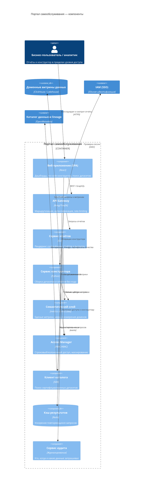

# Компоненты портала самообслуживания — C4 Component
Форматы: этот файл (Mermaid), [`diagrams/c4-component.png`](diagrams/c4-component.png)

## Диаграмма (Mermaid)

## Назначение компонентов

| Компонент          | Ответственность                                                                 | Масштабирование (3 года)                                              |
|--------------------|----------------------------------------------------------------------------------|-----------------------------------------------------------------------|
| Веб-приложение     | UI дашбордов и no-code конструктора                                              | Статический фронтенд, CDN; новые домены — без изменения ядра           |
| API Gateway        | Единая точка входа: аутентификация, маршрутизация, лимиты                        | Горизонтальное масштабирование; версионирование API                    |
| Сервис отчётов     | Выполнение и рендеринг отчётов, выгрузки                                         | Stateless, автоскейлинг под пиковые нагрузки (утренние срезы)          |
| Сервис конструктора| Сборка пользовательских датасетов/отчётов без кода                               | Self-service BI для любого числа доменов без участия платформы         |
| Семантический слой | Единые определения метрик (устраниение «отчётных разночтений» между доменами)    | Метрики регистрируются доменами (Data Mesh), слой остаётся общим       |
| Access Manager     | RBAC/ABAC: срезы строк/колонок, маскирование чувствительных данных               | Политики как код; аудит соответствия требованиям регуляторов           |
| Клиент каталога    | Поиск сертифицированных датасетов и lineage                                      | Каталог — источник доверия при росте числа дата-продуктов              |
| Кэш результатов    | Снижение нагрузки на витрины для повторяющихся запросов                          | TTL-кэш + инвалидация по событиям обновления витрин                    |
| Сервис аудита      | Журналирование всех обращений к данным                                           | Доказательство соответствия (мед-/фин-регуляторика), расследования ИБ  |

## Допущения

- Компонентный уровень показан для портала как наиболее критичного к доступности и правам
  доступа контейнера; остальные контейнеры платформы (шина, витрины) декомпозируются
  аналогично на этапе детального проектирования доменов.
- Семантический слой обязателен для сценария «единое представление по ключевым
  бизнес-показателям» при независимом развитии направлений.
- Медицинские карты, истории болезни и результаты исследований в портал не передаются;
  Access Manager дополнительно гарантирует, что даже агрегированные витрины не содержат
  запрещённые к аналитике данные (политики на уровне датасетов).
