# Целевая архитектура «Будущее 2.0» — C4 Container (горизонт 3 года)

Форматы: этот файл (Mermaid), [`diagrams/c4-container.png`](diagrams/c4-container.png)

## Диаграмма (Mermaid)

```mermaid
C4Context
  title Целевая архитектура «Будущее 2.0» — контейнеры (3 года)

  Person(ba, "Бизнес-пользователь / аналитик", "Отчёты и конструктор в пределах уровня доступа")
  Person(dpo, "Data Product Owner", "Владелец доменного дата-продукта")
  Person(de, "Data Engineer", "Платформа и доменные конвейеры")
  Person(doc, "Врач", "МИС; медкарты не входят в аналитику")

  System_Boundary(portal, "Портал самообслуживания (витрина данных)") {
    Container(portal_web, "Веб-приложение портала", "React/SPA", "Дашборды, конструктор отчётов")
    Container(portal_api, "BI API / сервис запросов", "Go/Python", "Запросы к витринам, семантический слой")
  }

  System_Boundary(platform, "Облачная платформа данных (Data Mesh)") {
    Container(bus, "Событийная шина", "Apache Kafka", "Доменные события, near-real-time")
    Container(schema, "Schema Registry", "Avro/Protobuf", "Контракты событий")
    Container(stream, "Потоковая обработка", "Apache Flink", "Потоковые витрины")
    ContainerDb(marts, "Доменные витрины", "ClickHouse + Lakehouse (S3, Iceberg)", "Аналитика без медкарт")
    Container(catalog, "Каталог данных и lineage", "OpenMetadata", "Дата-продукты, зависимости")
    Container(dlq, "DLQ + replay", "Kafka", "Обработка ошибок, повтор событий")
    Container(pinfra, "Self-service инфраструктура", "K8s, Terraform, CI/CD", "Шаблоны сред доменов")
    Container(iam, "IAM и доступ", "SSO, RBAC/ABAC", "Уровни доступа, аудит")
  }

  System_Boundary(fintech, "Домен: Финтех (банк)") {
    Container(fintech_svc, "Финтех-сервисы", "Golang/Java", "Кредиты, счета, транзакции")
  }
  System_Boundary(clinics, "Домен: Клиники / пациентский поток") {
    Container(mis, "МИС", "UI + операционные БД", "Приём, назначения; медданные в домене")
  }
  System_Boundary(ai, "Домен: ИИ-сервисы") {
    Container(ai_svc, "ИИ-сервисы", "Python", "Поддержка диагностики и лечения")
  }
  System_Boundary(hq, "Домен: Головной офис") {
    Container(hq_svc, "Финансы / HR / закупки", "ERP", "Отчётность, персонал, инвентаризация")
  }

  Container_Ext(pharma, "Фармкомпании", "Будущий домен", "Событийный контракт через ACL")
  Container_Ext(device, "Производитель мед. электроники", "Будущий домен", "Телеметрия через ACL")

  System_Ext(dwh, "DWH SQL Server 2008 (легаси)", "Мост: CDC + ACL к шине; вывод к концу 3-го года")
  System_Ext(camel, "ESB Apache Camel (легаси)", "Мост: ACL-адаптер к шине; отказ от точечных sync-интеграций")
  System_Ext(pbi, "Power BI поверх DWH (легаси)", "До переноса отчётности в портал")

  Rel(doc, mis, "Ведёт пациентов", "HTTPS")
  Rel(ba, portal_web, "Отчёты, конструктор", "HTTPS")
  Rel(dpo, catalog, "Управление дата-продуктом")
  Rel(de, pinfra, "Развёртывание сред", "IaC")

  Rel(fintech_svc, bus, "«Создан кредитный договор», «Проведена транзакция»", "events")
  Rel(mis, bus, "«Зарегистрирован новый пациент», «Назначено исследование»", "events")
  Rel(ai_svc, bus, "«Пройдено исследование ИИ»", "events")
  Rel(hq_svc, bus, "«Закрыт отчётный период»", "events")
  Rel(pharma, bus, "События через ACL", "events")
  Rel(device, bus, "Телеметрия через ACL", "events")

  Rel(bus, schema, "Валидация контрактов")
  Rel(bus, stream, "Потребление")
  Rel(bus, dlq, "Ошибочные сообщения")
  Rel(stream, marts, "Потоковые витрины")
  Rel(marts, portal_api, "SQL/OLAP")
  Rel(portal_web, portal_api, "REST/GraphQL")
  Rel(portal_api, iam, "Проверка доступа")
  Rel(portal_api, catalog, "Метаданные, lineage")

  Rel(dwh, bus, "CDC + ACL (мост миграции)")
  Rel(camel, bus, "ACL-адаптер (мост)")
  Rel(pbi, dwh, "Отчётность до миграции")
```

## Как изменятся ключевые системы при масштабировании (3 года)

| Система / процесс            | As-is                                            | To-be (3 года)                                                                   |
|------------------------------|--------------------------------------------------|----------------------------------------------------------------------------------|
| DWH SQL Server 2008          | Центр всей бизнес-логики и отчётности             | Мост совместимости: CDC + ACL отдаёт события в шину; логика переезжает в домены; вывод из эксплуатации |
| ESB Apache Camel             | Точечные синхронные интеграции «все-со-всеми»     | ACL-адаптер к событийной шине; синхронные интеграции снимаются с критического пути; отказ от ESB |
| Power BI поверх DWH          | Кастомизации поверх монолитного DWH, отчёты часами | Отчётность мигрирует в портал самообслуживания на доменных витринах              |
| PowerBuilder UI              | Интерфейс операторов клиник поверх DWH            | Веб-интерфейс МИС в домене «Клиники», событийная интеграция                      |
| Интеграция новых направлений | Доработки DWH под каждого нового участника        | Подключение публикацией/подпиской на события через ACL — без изменения ядра платформы |
| Отчётность                   | Batch, часы на сложный отчёт                      | Потоковые витрины near-real-time + self-service конструктор                        |
| Данные                       | Сотни ТБ в едином DWH, масса трансформаций        | Доменные дата-продукты (Data Mesh), lakehouse, единый каталог и lineage           |
| Инфраструктура               | Своё устаревающее оборудование                    | Облако: K8s, IaC (Terraform), self-service среды на домен, отказоустойчивость и гео-распределение |

### Этапность изменений

1. 0–6 мес (пилот) — событийная шина, Schema Registry, DLQ и каталог схем в 1–2 доменах
   («Финансовые расчёты» / «Пациентский поток»); первые ACL поверх Camel/DWH.
2. 6–18 мес (масштабирование) — платформа распространяется на критические домены, потоковые
   витрины, портал самообслуживания, ACL для всех интеграций через Camel и DWH; начало вывода
   точечных синхронных интеграций.
3. 18–36 мес (целевое состояние) — отказ от точечных синхронных интеграций на критическом пути,
   доменная аналитика на потоках данных, подключение фармы и производителя электроники как
   новых доменов, полный вывод легаси-мостов.

## Допущения

- Состав доменов определён по структуре компании из кейса (головной офис, клиники, ИИ, финтех)
  плюс будущие направления (фарма, мед. электроника).
- Конкретные технологии платформы (Kafka, Flink, ClickHouse, Lakehouse S3+Iceberg, OpenMetadata)
  закрепляются техрадаром в задании 5; на C4-диаграмме они указаны как иллюстрация выбора.
- Медицинские карты, истории болезни и результаты исследований остаются в операционных системах
  домена «Клиники» и в аналитические витрины/портал не передаются (требование кейса); событийные
  контракты несут только обезличенные факты (например, «исследование выполнено»).
- Легаси (DWH, Camel, Power BI) сохраняется на переходный период исключительно как мосты
  совместимости с плановым выводом к концу 3-го года.
