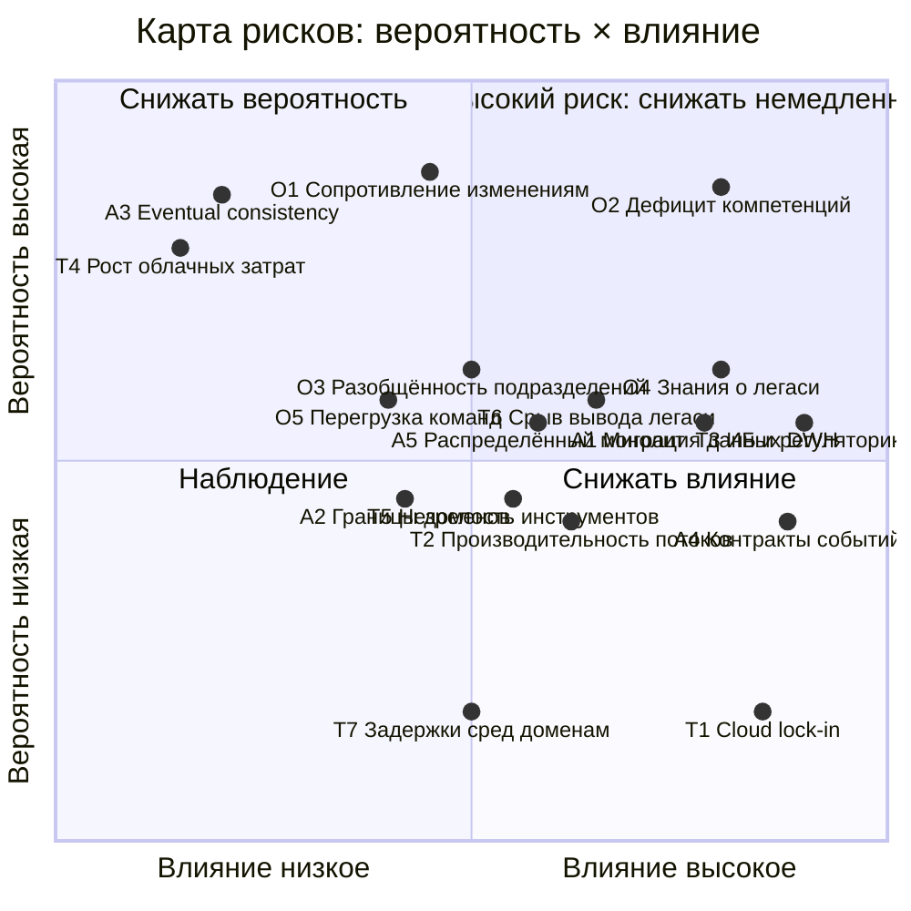

# Карта рисков трансформации «Будущее 2.0»

Оценка по двум осям: вероятность (низкая / средняя / высокая) × влияние на бизнес
(низкое / среднее / высокое). Итоговый уровень риска: высокий (красная зона),
средний (жёлтая зона), низкий (зелёная зона).

Визуализация: [`diagrams/risk-map.png`](diagrams/risk-map.png).

## Матрица (вероятность × влияние)

## Реестр рисков

### Архитектурные

| ID | Риск | Вероятность | Влияние | Уровень |
|----|------|-------------|---------|---------|
| A1 | Миграция данных и отчётности из DWH SQL Server 2008: искажения, потери, длительная двойная эксплуатация | средняя | высокое | высокий |
| A2 | Размытые границы доменов: дублирование данных, перекрёстные согласования каждого изменения | средняя | среднее | средний |
| A3 | Eventual consistency между доменами: временные расхождения метрик в отчётах | высокая | низкое | средний |
| A4 | Ломающие изменения схем событий выводят из строя потребителей в других доменах | средняя | высокое | высокий |
| A5 | «Распределённый монолит»: мосты Camel/DWH закрепляются как постоянные связи, сильная связанность сохраняется | средняя | среднее | средний |

### Организационные

| ID | Риск | Вероятность | Влияние | Уровень |
|----|------|-------------|---------|---------|
| O1 | Сопротивление изменениям, отсутствие культуры событийной разработки и Data Mesh | высокая | среднее | высокий |
| O2 | Дефицит компетенций и ролей: Data Product Owner, Data Engineer, BI-аналитик нового типа | высокая | высокое | высокий |
| O3 | Разобщённость подразделений (банк, клиники, ИИ): домены не договариваются о контрактах данных | средняя | среднее | средний |
| O4 | Знания о легаси (DWH 2008, PowerBuilder, Camel) сосредоточены у отдельных сотрудников | средняя | высокое | высокий |
| O5 | Перегрузка доменных команд: одновременная поддержка текущих систем и трансформация | средняя | среднее | средний |

### Технологические

| ID | Риск | Вероятность | Влияние | Уровень |
|----|------|-------------|---------|---------|
| T1 | Зависимость от облачного провайдера: lock-in, региональные сбои, изменение условий | низкая | высокое | средний |
| T2 | Производительность потоковой обработки и витрин при сотнях ТБ и росте числа источников | средняя | среднее | средний |
| T3 | Информационная безопасность и регуляторика: медицинские данные, банковская тайна, 152-ФЗ, требования в новых регионах | средняя | высокое | высокий |
| T4 | Рост облачных затрат без FinOps-практик (неконтролируемое потребление ресурсов доменами) | высокая | низкое | средний |
| T5 | Незрелость отдельных инструментов (каталог данных, Schema Registry, lakehouse) → операционные инциденты | средняя | среднее | средний |
| T6 | Срыв сроков вывода легаси из эксплуатации: мосты становятся постоянными, затраты не снижаются | средняя | среднее | средний |
| T7 | Задержки выделения сред и инфраструктуры доменам до полноценного self-service | низкая | среднее | низкий |

