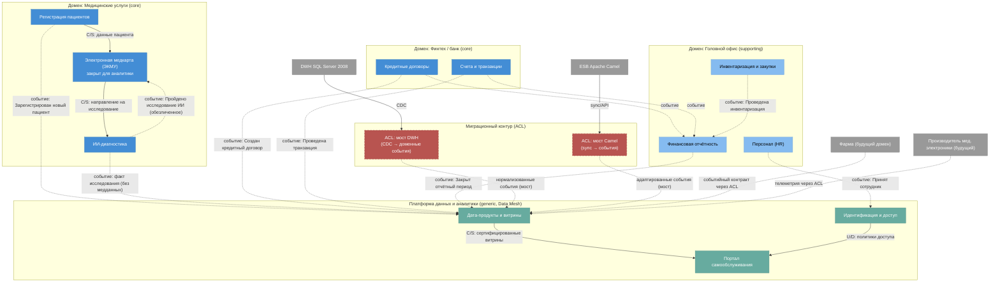

# Bounded Contexts «Будущее 2.0» (DDD)

Разделение системы на домены и ограниченные контексты (bounded contexts). Взаимодействие
контекстов — асинхронными доменными событиями через событийную шину (Published Language);
легаси подключается только через антикоррупционные слои (ACL).

Форматы: этот файл (Mermaid), [`diagrams/bounded-contexts.svg`](diagrams/bounded-contexts.svg),
[`diagrams/bounded-contexts.drawio`](diagrams/bounded-contexts.drawio).
Каталог событий — [`events.md`](events.md), агрегаты — [`aggregates.md`](aggregates.md).

## Классификация доменов

| Домен | Тип по DDD | Состав |
|-------|-----------|--------|
| Медицинские услуги (клиники) | **core** | Регистрация пациентов, Электронная медкарта (ЭКМУ), ИИ-диагностика |
| Финтех (банк) | **core** | Кредитные договоры, Счета и транзакции |
| Головной офис | supporting | Финансовая отчётность, Персонал (HR), Инвентаризация и закупки |
| Данные и аналитика | generic (платформа Data Mesh) | Дата-продукты и витрины, Портал самообслуживания, Идентификация и доступ |
| Миграционный контур | переходный | ACL-мост DWH, ACL-мост Camel (выводятся к концу 3-го года) |
| Будущие направления | партнёрские | Фарма, Производитель мед. электроники (подключение через ACL/событийные контракты) |

## Карта контекстов (Mermaid)

Пунктир — асинхронная интеграция доменными событиями (Published Language через Schema Registry);
сплошная линия — синхронное взаимодействие «поставщик–потребитель» (Customer/Supplier) внутри домена.

## Описание контекстов

| Контекст | Домен | Назначение и данные модели | Роль в интеграции |
|----------|-------|---------------------------|-------------------|
| **Регистрация пациентов** | Медицинские услуги | Персональные данные, полис, контакты, записи на приём | Источник событий о пациентском потоке |
| **Электронная медкарта (ЭКМУ)** | Медицинские услуги | Медкарты, истории болезни, назначения, результаты исследований | **Закрытый контур**: чувствительные медданные не покидают контекст; наружу — только факты без содержимого |
| **ИИ-диагностика** | Медицинские услуги | Направления на обработку, версии моделей, результаты (внутри) | Потребляет «Назначено исследование», публикует «Пройдено исследование ИИ» |
| **Кредитные договоры** | Финтех | Договоры, графики платежей, просрочки | Источник финансовых событий |
| **Счета и транзакции** | Финтех | Счета, двойная запись, балансы | Источник событий транзакций |
| **Финансовая отчётность** | Головной офис | Периоды, управленческая и регуляторная отчётность | Консумирует события финтеха и закупок; публикует закрытие периода |
| **Персонал (HR)** | Головной офис | Сотрудники, должности, стаж | Источник кадровых событий (провижининг доступа) |
| **Инвентаризация и закупки** | Головной офис | ТМЦ, оборудование, поставки | Поставщик фактов для финансов и витрин; точка входа будущих партнёров (фарма, электроника) |
| **Дата-продукты и витрины** | Платформа данных | Витрины доменов, метрики, SLA, сертификаты качества | Потребитель всех публичных событий; поставщик для портала |
| **Портал самообслуживания** | Платформа данных | Отчёты, дашборды, конструктор | Потребитель витрин; enforcement доступа |
| **Идентификация и доступ** | Платформа данных | Пользователи, роли, политики RBAC/ABAC | Подписчик кадровых событий; поставщик политик |
| **ACL: мост DWH** | Миграционный | CDC-поток изменений SQL Server 2008, нормализация в доменные события | Антикоррупционный слой; защищает модель доменов от легаси-схем |
| **ACL: мост Camel** | Миграционный | Адаптер маршрутов ESB в событийные контракты | Антикоррупционный слой; демонтируется по мере переноса интеграций |

## Паттерны связей

- **Published Language (события)** — основной паттерн между доменами: контракты событий
  версионируются в Schema Registry (см. [`events.md`](events.md)).
- **Customer/Supplier** — внутри доменов (Регистрация → ЭКМУ → ИИ; Дата-продукты → Портал):
  потребитель участвует в планировании поставщика.
- **Anticorruption Layer (ACL)** — все связи с легаси и будущими внешними доменами: модель
  домена не «заражается» чужими схемами.
- **Conformist** — не используется сознательно: ни один домен не подстраивается под модель
  DWH/Camel, это задача ACL.

## Допущения

- Границы контекстов выведены из описания ландшафта кейса (DWH-сущности, подразделения,
  технологии) и потоков `input/data_flow.png`; уточняются Event Storming-сессиями с доменами
  на этапе пилота.
- «ЭКМУ» и «ИИ-диагностика» разделены, хотя сегодня живут в одном DWH: у них разные причины
  меняться (медицинские протоколы vs ML-модели) и разные требования к изоляции данных.
- Финтех остаётся отдельным core-доменом банка с банковской лицензией — юридический контур
  требует изоляции данных и своей отчётности.
