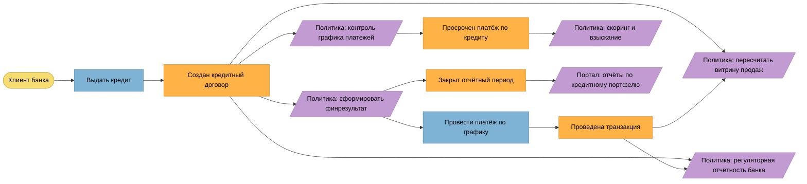
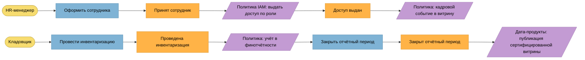

# Event Storming «Будущее 2.0»

Событийная модель ключевых сценариев: команды (синие), доменные события (оранжевые),
политики/подписчики (фиолетовые), акторы (жёлтые). 

Форматы: этот файл (Mermaid), [`diagrams/event-storming.png`](diagrams/event-storming.png).
Контракты событий — [`events.md`](events.md).

## Сценарий 1. Пациентский поток и ИИ-исследование

```mermaid
flowchart LR
  classDef actor fill:#F7DC6F,color:#000,stroke:#C9B458
  classDef cmd fill:#7FB3D5,color:#000,stroke:#5B91B3
  classDef evt fill:#FFB347,color:#000,stroke:#D99A3C
  classDef pol fill:#C39BD3,color:#000,stroke:#A37FB3

  A1(["Регистратор"]):::actor
  C1[Зарегистрировать пациента]:::cmd
  E1[Зарегистрирован новый пациент]:::evt
  P1[/Политика: открыть медкарту/]:::pol
  C2[Создать запись на приём]:::cmd
  E2[Создана запись на приём]:::evt
  A2(["Врач"]):::actor
  C3[Назначить исследование]:::cmd
  E3[Назначено исследование]:::evt
  P2[/Политика ИИ: взять в обработку/]:::pol
  E4[Пройдено исследование ИИ]:::evt
  P3[/Политика: результат врачу внутри ЭКМУ/]:::pol
  P4[/Политика: обезличенный факт в аналитику/]:::pol
  E5[Факт исследования учтён в витрине]:::evt
  P5[/Дата-продукт: метрики пациентского потока/]:::pol

  A1 --> C1 --> E1 --> P1 --> C2 --> E2 --> A2
  A2 --> C3 --> E3 --> P2 --> E4
  E4 --> P3
  E4 --> P4 --> E5 --> P5
  E1 -.-> P5
```

Источники событий: «Зарегистрирован новый пациент» — контекст Регистрация пациентов;
«Назначено исследование» — ЭКМУ; «Пройдено исследование ИИ» — ИИ-диагностика.
Подписчики: ЭКМУ (результат врачу — внутри закрытого контура), Дата-продукты
(только обезличенные факты), Финансовая отчётность (основание для выставления счёта).

## Сценарий 2. Финтех: кредит и транзакции

Источники: Кредитные договоры, Счета и транзакции, Финансовая отчётность.
Подписчики: Дата-продукты (витрины продаж и портфеля), Финансовая отчётность,
регуляторный контур банка, Портал (через витрины).

## Сценарий 3. Корпоративный контур: персонал, закупки, доступы

Источники: Персонал (HR), Инвентаризация и закупки, Финансовая отчётность,
Идентификация и доступ. Подписчики: IAM (провижининг), Дата-продукты, Финансовая отчётность.

## Сводка «событие → источник → подписчики»

| Событие | Контекст-источник | Подписчики (основные) |
|---------|-------------------|------------------------|
| Зарегистрирован новый пациент | Регистрация пациентов | ЭКМУ, Дата-продукты, Финтех (идентификация клиента), IAM |
| Создана запись на приём | Регистрация пациентов | Дата-продукты (загрузка клиник) |
| Назначено исследование | ЭКМУ | ИИ-диагностика |
| Пройдено исследование ИИ | ИИ-диагностика | ЭКМУ (результат врачу), Дата-продукты (обезличенный факт), Финансовая отчётность (основание счёта) |
| Создан кредитный договор | Кредитные договоры | Дата-продукты, Финансовая отчётность, регуляторный контур банка |
| Проведена транзакция | Счета и транзакции | Финансовая отчётность, Дата-продукты |
| Просрочен платёж по кредиту | Кредитные договоры | Взыскание, Финансовая отчётность, Дата-продукты (риск-метрики) |
| Принят сотрудник | Персонал (HR) | IAM (доступы), Финансовая отчётность (ФОТ), Дата-продукты |
| Доступ выдан | Идентификация и доступ | Аудит/ИБ |
| Проведена инвентаризация | Инвентаризация и закупки | Финансовая отчётность, Дата-продукты |
| Закрыт отчётный период | Финансовая отчётность | Дата-продукты (сертификация витрин), Портал |
| Изменена запись в DWH (техническое) | ACL: мост DWH | Нормализатор → доменные события (переходный период) |
| Поставка товара (будущее) | Фарма через ACL | Инвентаризация и закупки, Дата-продукты |
| Телеметрия оборудования (будущее) | Производитель электроники через ACL | Инвентаризация, Дата-продукты, ИИ-диагностика (качество оборудования) |

