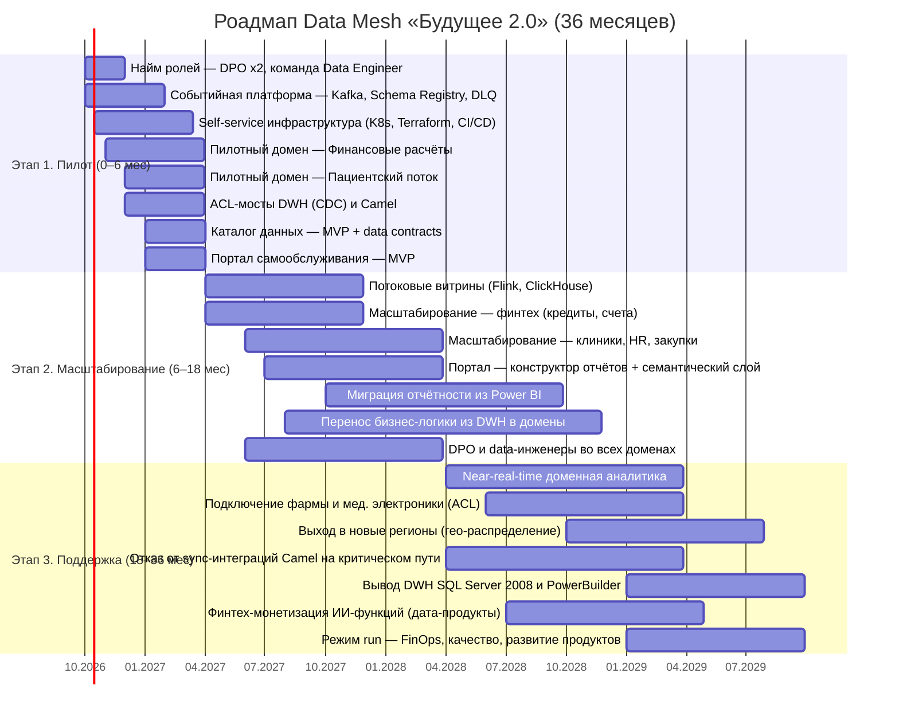

# Стратегический роадмап внедрения Data Mesh (36 месяцев)

Три этапа трансформации из кейса: пилот (0–6 мес) → масштабирование (6–18 мес) →
поддержка доменов (18–36 мес). Каждый этап привязан к бизнес-целям «Будущего 2.0».

## Диаграмма Ганта

## Этапы, результаты и привязка к бизнес-целям

### Этап 1 — Пилот (0–6 мес)

Бизнес-цели кейса (промежуточное состояние): архитектурное решение сформировано и
согласовано; границы доменов определены; в доменах запланированы проекты развития витрины данных.

| Направление | Ключевые результаты | KPI |
|-------------|---------------------|-----|
| Платформа | Событийная шина Kafka + Schema Registry + DLQ; единые принципы работы с событиями (требование кейса) | 100 % событий пилота через реестр схем |
| Пилотные домены | «Финансовые расчёты» и/или «Пациентский поток» публикуют дата-продукты | ≥ 2 дата-продукта в каталоге |
| Мосты | ACL поверх DWH (CDC) и Camel — легаси не блокирует пилот | 0 прямых подключений к легаси мимо ACL |
| Портал | MVP: дашборды пилотных доменов, RBAC | первые 10+ бизнес-пользователей |
| Организация | Наняты DPO пилотных доменов и команда Data Engineer; CoE | роли укомплектованы |

### Этап 2 — Масштабирование (6–18 мес)

Бизнес-цели кейса (финальное состояние года): реализован портал самообслуживания;
бизнес-пользователи в доменах работают в новой архитектуре; легаси допускается только
в отдельных доменах как мосты.

| Направление | Ключевые результаты | KPI |
|-------------|---------------------|-----|
| Домены | Финтех, клиники, HR, закупки — на событийной интеграции; антикоррупционные слои для всех Camel/DWH-интеграций | ≥ 80 % критических потоков через шину |
| Витрины | Потоковые витрины (near-real-time) для финтеха и пациентского потока | лаг данных ≤ 5 мин |
| Портал | Конструктор отчётов + семантический слой; миграция ключевых отчётов из Power BI | ≥ 70 % отчётов перенесено; adoption 200+ пользователей |
| Legacy | Перенос бизнес-логики из DWH в домены; начало демонтажа маршрутов Camel | −50 % трафика через ESB |
| Организация | DPO и аналитики-инженеры во всех доменах; гильдии и обучение | укомплектованность ролей 100 % |

### Этап 3 — Поддержка и целевое состояние (18–36 мес)

Долгосрочные цели кейса: продукты (новые финтех-/медсервисы, монетизация ИИ),
география (2–3 новых региона), данные (near-real-time, рост источников);
слабосвязанная событийная платформа, мосты демонтированы.

| Направление | Ключевые результаты | KPI |
|-------------|---------------------|-----|
| Платформа | Отказ от точечных синхронных интеграций на критическом пути; доменная аналитика на потоках | 0 sync-интеграций на критическом пути |
| Legacy | Вывод DWH SQL Server 2008, PowerBuilder, ESB Camel | легаси выведено (stop-даты) |
| Новые домены | Фарма и производитель электроники подключены событийными контрактами через ACL | time-to-connect нового домена ≤ 2 недель |
| География | Гео-распределённое развёртывание, локальные требования регуляторов учтены | 2–3 региона, RPO/RTO в SLA |
| Монетизация | Дата-продукты ИИ-метрик для финтеха и партнёров | ≥ 2 монетизируемых дата-продукта |
| Run | FinOps, качество данных, развитие продуктов силами доменов | TCO run-rate ≤ 96 %·X (модель TCO, −20 % к as-is) |

## Ключевые роли

| Роль | Зона ответственности | Когда и сколько |
|------|----------------------|------------------|
| Data Product Owner (DPO) | Владелец дата-продукта домена: бэклог, потребители, SLA и качество, монетизация; отвечает за «продуктовую» упаковку данных домена | 2 в пилоте (этап 1) → по одному на домен (этап 2) → во всех доменах включая новых партнёров (этап 3) |
| Data Engineer | Конвейеры домена и платформы: событийные потоки (Kafka/Flink), витрины (ClickHouse/Iceberg), dbt-трансформации, качество и наблюдаемость; этапом 1 — ядро платформенной команды, далее — в доменах | Команда 4–6 на платформе (этап 1) → 2–3 на домен (этап 2–3) |
| BI-аналитик → Analytics Engineer | Семантический слой и метрики, сертификация витрин, обучение бизнес-пользователей конструктору отчётов, миграция отчётов из Power BI | 2–3 в центре компетенций (этап 1–2) → по доменам (этап 3) |
| Платформенная команда (Platform Engineering) | Self-service инфраструктура: шаблоны сред (Terraform), CI/CD, observability, каталог | с этапа 1 постоянно |
| CDO / Главный архитектор | Data governance, стандарты событий и контрактов, техрадар, архитектурный комитет | с этапа 1 постоянно |
| CISO | Соответствие 152-ФЗ и банковской тайне, доступы, аудит | постоянно |

## Зависимости и риски

- Этап 2 начинается только при критериях выхода пилота (KPI этапа 1) — gate-ревью риск-комитета.
- Главные зависимости: укомплектованность ролей (риск O2), график вывода легаси (T6),
  производительность потоков на полном объёме данных (T2). Меры — в плане управления рисками
  (задание 3).
- Бюджет по этапам — в [`tco-analysis.md`](tco-analysis.md) (пик миграционных затрат в годах 1–2).
